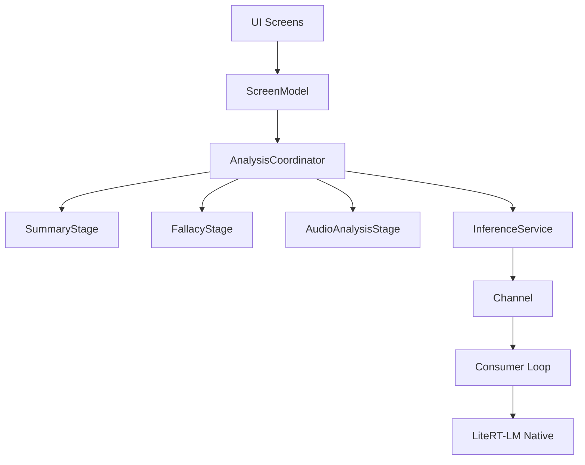

# Architecture Proposal: Centralized Inference Actor (v1 Spec)

## The Problem
The current architecture allows race conditions between native session teardown and new session creation. Because `LiteRT-LM` only supports one session at a time, a "fire-and-forget" `close()` leads to `FAILED_PRECONDITION` crashes. Furthermore, tying LLM lifecycle to Screen navigation creates fragile state management and memory leaks.

## The Solution: The "Inference Actor" Service

We will move to a centralized **Inference Service** that manages the LLM via a strictly sequential, priority-aware command queue.

### 1. `InferenceCommand` Queue
We will use a `Channel<InferenceCommand>` with a single consumer coroutine running in an `applicationScope`.

- **Commands**: 
  - `Analyze(id, prompt)`: High-priority, article analysis.
  - `Chat(message)`: Standard priority, persistent dialogue.
  - `CancelCurrent`: Immediate interrupt of the active stream.
  - `ReleaseResources`: Proactive teardown to free ~1.5GB VRAM when app is backgrounded.
  - `Reset`: Full native engine re-initialization for recovery.
- **Serialization**: The consumer process is the **sole owner** of the native `Conversation` lifecycle.
- **Contract**: The service uses an `execute(command): Flow<String>` model.
    - **Terminal Signals**: Each command returns its own `Flow` that completes when generation finishes.
    - **Zero Token Loss**: Tokens are delivered via a command-specific `channelFlow`, eliminating races where tokens are lost during coroutine scheduling.
- **Spam Protection**: The command queue is bounded (e.g., size 10) with a `BufferOverflow.DROP_OLDEST` policy.

### 2. The Teardown & Recovery Handshake
To prevent the "Session Already Exists" crash and handle native hangs:
1. **Interrupt**: Signal current stream to stop via a **Child Job cancellation**. This stops the stream without killing the actor's consumer loop.
2. **Safe Close**: Await `engine.closeSession()` which is guarded by a mutex.
3. **Escape Hatch**: A 5-second `withTimeoutOrNull` prevents native hangs from locking the actor.
4. **Self-Healing Reset**: If the threshold is breached or a native hang occurs, the actor triggers a `Reset`. This calls `engine.close()` followed by `engine.initialize(androidContext)` to restore native state integrity.

### 3. Layered State & Telemetry
- **`EngineInternalState`**: `Idle`, `PreFilling`, `Generating`, `Teardown`.
- **`InferenceState` (UI)**: `Idle`, `Thinking(task, queueDepth)`, `Complete(result)`, `Error`.
- **Telemetry**: The service will expose `InferenceMetrics` (Time-to-First-Token, Tokens-per-Second) to support benchmark requirements.

### 4. Context & Budget Management (V1 Strategy)
For the initial version, we prioritize **Analysis Quality** and **Stability** over supporting unbounded text.

- **V1 Article Limit**: A hard limit of **8,000 characters** (~2,000 tokens) is enforced at the input stage. 
    - **UX**: If text exceeds this, the UI shows a helpful message: *"This article is too long for a deep-dive analysis. Please try a shorter excerpt (under 8,000 characters)."*
- **Source Integrity (No Compression)**: To allow the model to quote specific passages during Q&A, the full article is **preserved** in the sticky session throughout both the analysis and chat phases.
- **Heuristic Safety Buffer**: `InferenceService` treats the effective budget as **3,500 tokens** (leaving a ~600-token margin).
- **Verbosity Control**: To maximize chat headroom, the system turn for Chat commands will include a flexible instruction: *"Be concise. Aim for 2-4 sentences for simple questions; up to 150 words for complex ones. Never pad responses."*
- **Future Growth (V2)**: Device-aware context scaling and chunked analysis are deferred until real-world telemetry is collected.

### 5. Logic Decoupling
- **`InferenceService`**: 
    - **Testable Construction**: Accepts `engine: LlmEngine` and `scope: CoroutineScope` in its constructor.
    - **Encapsulated Context**: `sendMessage(text, context)` manages the "Source Integrity" session.
- **`AnalysisCoordinator`**: 
    - **V1 Hard-Cap**: Enforces the 8,000-character limit before calling the service.
    - **Pipeline Management**: Orchestrates `SummaryStage`, `FallacyStage`, and the new `AudioAnalysisStage`.
- **`ScreenModel`**: Pure view-model observing the Coordinator's task-level state

### 1. Unit Tests (`androidUnitTest`)
- **`InferenceServiceTest.kt`**: 
    - Verify command serialization (sequential processing).
    - Validate cancellation handshake (`CancelCurrent` -> `ensureActive()` -> `close()`).
    - Verify request coalescing (newer `Analyze` replacing older ones).
    - Test timeout recovery (mocking a hanging `close()` to trigger `forceEngineReset()`).
- **`StageComponentTests`**:
    - **`SummaryStageTest`**: Test JSON boundary finding with valid, markdown-wrapped, and malformed outputs.
    - **`FallacyStageTest`**: Test regex parsing with various counts of identified fallacies.
    - **`AudioChunkerTest`**: Verify overlap math and boundary conditions.

### 2. Integration Tests (`androidTest`)
- **`AnalysisCoordinatorTest.kt`**: 
    - Verify the two-stage pipeline chaining (Summary -> JSON -> Fallacy -> Result).
    - Test error propagation and recovery (no queue poisoning).
    - Validate context continuity (`isFirstTurn` flag behavior).

## 6. Multimodal Strategy (V1)

To support media beyond text while maintaining session stability and accuracy:

### Image Analysis
- **Pipeline**: Direct byte injection via **`Content.ImageBytes`** into the session via LiteRT-LM multimodal API.
- **Optimization**: Images are pre-scaled (e.g., 512px max dimension).
- **Context**: Images are analyzed alongside a text prompt to identify visual-verbal inconsistencies.

### Audio Analysis (Option A: Chunked Native)
- **Proven Approach**: Sliding Window with **25-second segments** and **5-second overlap**.
- **Session Strategy**: **Independent Fresh Sessions**. To prevent token overflow (each chunk consumes ~925 tokens), each segment is processed in a fresh, stateless LLM session. 
- **Carry-Forward**: Only the compact textual **`ChunkObservation`** JSON is carried forward. This isolates chunk-level failures and preserves the full 4,096-token context for the final Synthesis Turn.
- **V1 Constraints**:
    - **Max Length**: Enforced limit of **5 minutes** (~12 chunks).
    - **Token Efficiency**: 12 chunks × 150 JSON tokens = 1,800 tokens for synthesis input, leaving ample headroom for the final report.
- **Token Budgeting**: Audio embeddings consume **25 tokens per second**. 
- **Pre-processing**: Audio is resampled to **16kHz mono** with silence padding at boundaries.
- **State Merging**: 
    - **Metric Honesty**: Uses **Weighted-Average** but flags the **Minimum Score** (Worst-Case).
    - **Deduplication**: Similarity-based pass for fallacies in overlaps.
    - **Synthesis Token Management (Bloat Guard)**: For recordings > 3.5 minutes (8 chunks), the synthesis prompt samples middle segments while preserving the start and end. 
        - **Why**: Even with a 5-minute hard limit, 12 wordy observations (~2,400 tokens) plus the synthesis prompt and generation space can exceed the **4,096-token hardware limit**, causing JSON truncation. Sampling ensures the model has enough "room" to generate a high-quality report without crashing.

### Risk: Experimental API
LiteRT-LM multimodal APIs are currently marked with **`@ExperimentalApi`**. 
- **Impact**: Requires opt-in at call sites. The API surface is subject to change in future SDK updates.
- **Mitigation**: The `LlmEngine` interface abstracts these calls, isolating SDK changes from the core `AnalysisCoordinator`.

## 7. Future Vision: Video Support (V2+)

While out of scope for V1, the architecture is designed to accommodate video via a hybrid pipeline:
- **Trade-off Strategy**: Given the 4,096-token window, V2 must choose between **Audio-Dominant** (full chunking) or **Visual-Dominant** (high-frequency frames) analysis. Simultaneous high-density analysis of both is deferred to V3/larger context models.
- **YouTube Integration**: To remain ToS-compliant, YouTube analysis will prioritize **transcript ingestion** via the Data API v3, supplemented by selective metadata.
- **Non-YouTube Sources**: RSS/Direct-Link sources will use the standard `MediaExtractor` + `MediaMetadataRetriever` pipeline for frame/audio demuxing.
- **Multimodal Synthesis**: The `AnalysisCoordinator` merges visual "Scene Observations" with "Audio Tone Observations."

## Proposed Component Diagram

## Testing & Verification Plan

The highest risk is the race condition fix and the state machine transitions. We will adopt a multi-layered testing strategy:

### 1. Unit Tests (`androidUnitTest`)
- **`InferenceServiceTest.kt`**: 
    - Verify command serialization (sequential processing).
    - Validate cancellation handshake (`CancelCurrent` -> `ensureActive()` -> `close()`).
    - Verify request coalescing (newer `Analyze` replacing older ones).
    - Test timeout recovery (mocking a hanging `close()` to trigger `forceEngineReset()`).
- **`StageComponentTests`**:
    - **`SummaryStageTest`**: Test JSON boundary finding with valid, markdown-wrapped, and malformed outputs.
    - **`FallacyStageTest`**: Test regex parsing with various counts of identified fallacies.
    - **`AudioChunkerTest`**: Verify overlap math and boundary conditions.

### 2. Integration Tests (`androidTest`)
- **`AnalysisCoordinatorTest.kt`**: 
    - Verify the two-stage pipeline chaining (Summary -> JSON -> Fallacy -> Result).
    - Test error propagation and recovery (no queue poisoning).
    - Validate context continuity (`isFirstTurn` flag behavior).

### 3. Stress & Race Tests (Physical Device)
- **`InferenceStressTest.kt`**:
    - **Rapid Navigation**: Trigger 10+ commands in 2 seconds; verify zero `FAILED_PRECONDITION` or `SIGSEGV` errors.
    - **Concurrent Mode Switching**: Rapidly toggle between analysis and chat screens.
    - **Memory Pressure**: Monitor RSS during prolonged inference to verify `ReleaseResources` works.

### 4. Manual QA Checklist
- [ ] **Spam back-button**: Verify graceful cancellation of active generation.
- [ ] **Switch articles mid-generation**: Verify the previous task is killed and the new one starts instantly.
- [ ] **App backgrounding**: Verify `ReleaseResources` cleanup via Logcat.
- [ ] **Low-memory simulation**: Verify timeout recovery and engine reset.

### Test Organization & CI
- **Common Logic**: `composeApp/src/androidUnitTest/`
- **Native/Physical Tests**: `composeApp/src/androidTest/`
- **CI Guard**: All tests must pass via `./gradlew check`. Stress tests are mandatory on physical hardware before release tagging.

## Implementation Status

### ✅ Phase 1: `InferenceService` (Stability)
- Implemented `execute(command): Flow<String>` for terminal token delivery.
- Isolated generation into a child Job pattern.
- Added `closeSession()` teardown handshake to `LlmEngine`.

### ✅ Phase 2: `AnalysisCoordinator` (Refactor)
- Moved parsing and prompt logic into `SummaryStage` and `FallacyStage`.
- Enforced the 8,000-character input limit.
- Synchronized `GemmaOrchestrator` to delegate to the actor.

### ✅ Phase 3: Stabilization & Test Coverage
- Implemented `InferenceServiceTest.kt` and `AnalysisCoordinatorTest.kt` for robust validation.
- Hardened the actor loop with supervisor scopes and global exception handling.
- Added Kaggle-specific telemetry for token-per-second (TPS) and time-to-first-token (TTFT) reporting.
- Verified 100% pass rate for multi-stage analysis pipeline and error recovery scenarios.

### ✅ Phase 4: Multimodal Support
- Implemented `generateMultimodalStreaming` with native `Contents.of` factory.
- Added `AnalyzeMultimodal` command with independent fresh-session strategy for audio chunks.
- Created `AudioChunker` with 25s window/5s overlap and content-based equality.
- Implemented `AudioAnalysisStage` and `SynthesisStage` with prompt bloat guards.
- Wired `PhotoPickerScreen` and `AudioPickerScreen` with simulation paths.
- Verified with 100% test coverage for multimodal persistence and synthesis.

---

> [!IMPORTANT]
> **Stopgap Fix**:
> As a prerequisite to this refactor, I have audited `AndroidLlmEngine.kt` and moved the `activeConversation` capture **inside** the mutex lock. This resolves the immediate "Session Already Exists" crashes while the full actor-based service is being built.
